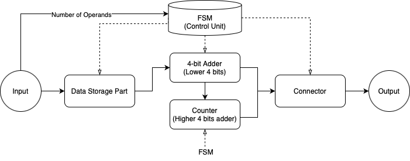
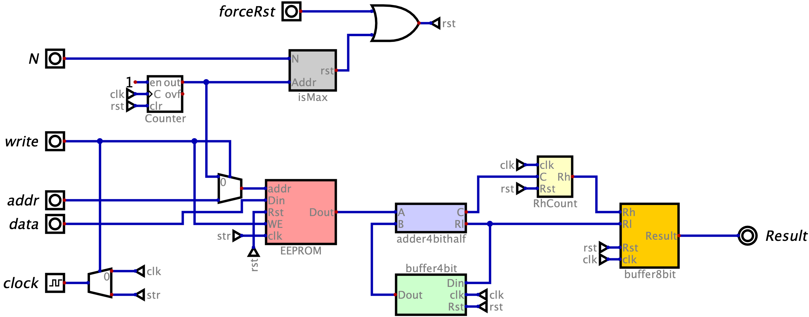
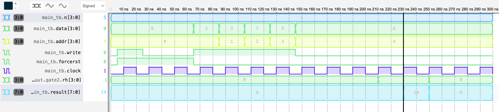

# Generalized Adder Design - UofG UESTC3020 Coursework

## Overview

This repository contains the coursework project for UofG UESTC3020, focused on the **design and simulation of a generalized digital adder** using VHDL.

---

## Project Structure

### Part I: Combinational Circuit Design
- **Objective**: Develop and optimize a 2-bit adder, then reuse it to construct a 4-bit adder.
- **Validation**: Simulated using Logisim for correctness.

### Part II: Validation of Combinational Designs
- **Behavioral Description**: VHDL implementation of the 2-bit and 4-bit adders.
- **Simulation**: Verified both behavioral and structural descriptions using testbenches.

### Part III: Generalized Adder
- **Goal**: Design a modular adder capable of sequentially adding up to 16 4-bit numbers.
- **Components**: Data storage, FSM (control logic), 4-bit adder, and output connectors.
- **Validation**: Simulated as a complete system using structural VHDL description.

---

## Configuring the Toolchain

Follow these steps to set up the toolchain on MacOS or Linux (which is used to compile the `VHDL` files without Vivado):

### 1. Install Toolchain

Ensure a minimal RTL toolchain is installed. Follow the guide [here](https://marcobisky.github.io/p/rtl-analysis-on-macos-under-300mb/) for setup instructions.

### 2. Specify Circuit Folder

Modify the `Makefile` to choose a circuit folder (`behavior`, `dataflow`, or `structural`). Uncomment the relevant line:

```makefile
# Uncomment one of the following:
CIRCUIT_DIR = behavior
# CIRCUIT_DIR = dataflow
# CIRCUIT_DIR = structural
```

### 3. Run Simulations

Use `make` commands for testing:

- View available commands:
  ```bash
  cd vhdl
  make help
  ```
- Test a specific block (e.g., `adder2bit`):
  ```bash
  make run CIRCUIT=adder2bit
  ```
- Test the entire system (`main.vhdl`, only for `dataflow` or `structural`):
  ```bash
  make run
  ```

Ensure the corresponding testbench exists in the `testbench` folder before running simulations.

---

## See Visual and Interactive Results

Please download Digital software [here](https://github.com/hneemann/Digital) and use that to open the source file `main.dig` inside `digitalSim` folder.

---

## Folder Details

```
├── digitalSim/               # Interactive simulation source file in Digital
│   ├── adder2bitfull.dig
│   ├── adder4bitfull.dig
│   ├── buffer4bit.dig
│   └── ...
├── images/                   # Circuit diagram or simulation waveform
│   ├── adder2bit_tb.png
│   └── ...
├── Requirement/              # The coursework requirements from UofG
│   └── ...
├── vhdl/                     # All source files in VHDL language
│   ├── behavior/
│   │   ├── adder2bit.vhdl
│   │   └── ...
│   ├── dataflow/
│   │   ├── adder2bit.vhdl
│   │   └── ...
│   ├── structural/
│   │   ├── adder2bit.vhdl
│   │   └── ...
│   ├── testbench/
│   │   ├── adder2bit_tb.vhdl
│   │   └── ...
│   └── Makefile
├── README.md
└── report.pdf                # Detailed report in PDF
```

### **`Behavior` Folder**
- Contains mainly behavioral descriptions of each block.
- Subcircuits (e.g., `Dff.vhdl`) are described behaviorally, while larger blocks (e.g., `buffer4bit.vhdl`) use structural descriptions inevitably.

### **`dataflow` Folder**
- Focuses on dataflow descriptions of blocks. Includes `main.vhdl` for testing the entire system.

### **`structural` Folder**
- Contains validated blocks from `behavior` and integrates them into a complete structural design (`main.vhdl`).

---

## Results

1. **2-Bit and 4-Bit Adders**:
   - Simulated and verified through VHDL testbenches.
   - Achieved correct outputs for all test cases.

2. **Generalized Adder**:
   - Successfully simulated for up to 16 sequential 4-bit inputs.
   - Verified correct carry propagation and summation through simulation.

### Example Figures
#### Block Diagram


#### Main Circuit Diagram


#### Main Simulation Waveform


---

## Contributors

- **Jinming Ren** (3191293752@qq.com)
- **Yuhao Liu**

For detailed explanations, refer to the full report in `report.pdf`.